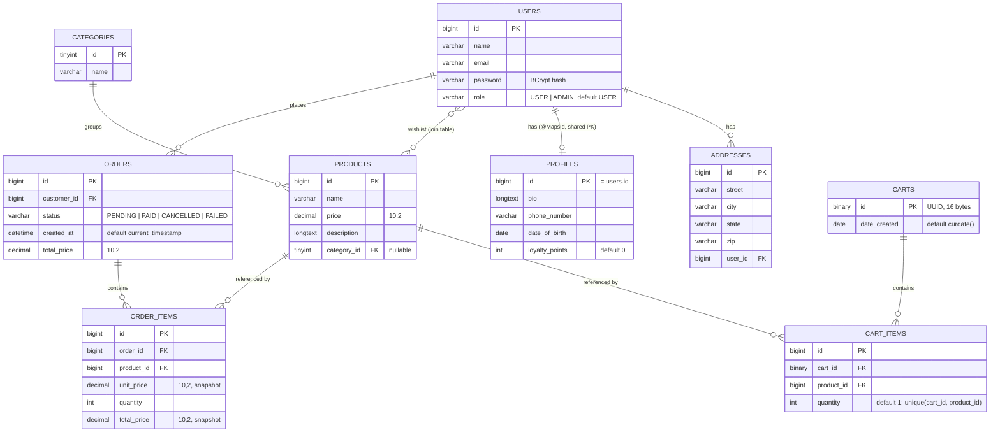

# SpringStore

## 1. Overview

A REST backend for a small online grocery store. It exposes product browsing, anonymous shopping carts, user registration with JWT authentication, order creation, and a Stripe Checkout payment flow with a webhook that updates order status. It is a learning/portfolio
project: one external integration (Stripe), one database (MySQL), no frontend beyond a single Thymeleaf placeholder page, and two test classes covering six tests.

---

## 2. Tech stack

| Component | Technology | Version |
|---|---|---|
| Language | Java | 17 (`java.version`; built and tested here on JDK 22) |
| Framework | Spring Boot | 3.5.5 |
| Web | spring-boot-starter-web (Spring MVC, embedded Tomcat) | managed by Boot 3.5.5 |
| Security | spring-boot-starter-security | managed by Boot 3.5.5 |
| Persistence | spring-boot-starter-data-jpa (Hibernate) | managed by Boot 3.5.5 |
| Database | MySQL (`mysql-connector-j`) | driver managed by Boot 3.5.5 |
| Migrations | Flyway (`flyway-core`, `flyway-mysql`) | managed by Boot; `flyway-maven-plugin` 11.7.2 |
| JWT | jjwt (`jjwt-api` 0.12.6, `jjwt-impl` 0.12.6, `jjwt-jackson` 0.12.5) | 0.12.x |
| Payments | `com.stripe:stripe-java` | 29.0.0 |
| DTO mapping | MapStruct (`mapstruct` 1.6.2, `mapstruct-processor` 1.6.3) | 1.6.x |
| Boilerplate | Lombok | 1.18.34 |
| Validation | spring-boot-starter-validation (Jakarta Bean Validation) | managed by Boot 3.5.5 |
| API docs | `springdoc-openapi-starter-webmvc-ui` | 2.8.6 |
| Templates | spring-boot-starter-thymeleaf + `thymeleaf-extras-springsecurity6` | managed by Boot 3.5.5 |
| Env loading | `me.paulschwarz:spring-dotenv` | 4.0.0 |
| Monitoring | spring-boot-starter-actuator | managed by Boot 3.5.5 |
| Testing | JUnit 5, Mockito, AssertJ (via spring-boot-starter-test), spring-security-test | managed by Boot 3.5.5 |
| Build | Maven Wrapper | Maven 3.9.11 |

---

## 3. Architecture

### Layers

Packages are organised by feature, not by technical layer. Each feature package
(`auth`, `users`, `products`, `carts`, `orders`, `payments`, `admin`) holds its own
controller, service, repository, entities, DTOs, exceptions, and security rules.
`common` holds cross-cutting pieces.

```
com.golzstore.springstore
├── StoreApplication          @SpringBootApplication
├── admin                     AdminController, AdminSecurityRules
├── auth                      SecurityConfig, JwtService, Jwt, JwtConfig,
│                             JwtAuthenticationFilter, AuthController, AuthService
├── carts                     Cart, CartItem, CartController/Service/Repository/Mapper
├── common                    SecurityRules, GlobalExceptionHandler, LoggingFilter,
│                             HomeController, SwaggerSecurityRules, ErrorDto
├── orders                    Order, OrderItem, OrderController/Service/Repository/Mapper
├── payments                  PaymentGateway, StripePaymentGateway, CheckoutController,
│                             CheckoutService, StripeConfig, PaymentStatus
├── products                  Product, Category, ProductController, repositories, mapper
└── users                     User, Address, Profile, Role, UserController/Service,
                              UserServiceImpl (UserDetailsService), UserMapper
```

### Request flow

```
HTTP request
  → LoggingFilter                 (common; prints URI, then response status)
  → JwtAuthenticationFilter       (auth; runs before UsernamePasswordAuthenticationFilter)
       reads "Authorization: Bearer <token>", JwtService.parseToken,
       on a valid non-expired token puts a UsernamePasswordAuthenticationToken into
       the SecurityContext with principal = userId (Long) and authority "ROLE_" + role
  → Spring Security authorization  (SecurityConfig.securityFilterChain; rules contributed
       by every SecurityRules bean, then anyRequest().authenticated())
  → @RestController               (validates @Valid request bodies)
  → @Service                      (business logic)
  → Spring Data repository        (Hibernate → MySQL)
  → MapStruct mapper              (entity → DTO)
  → JSON response
```

Errors are handled in three places: `GlobalExceptionHandler` (`@ControllerAdvice`) for
unreadable bodies and bean-validation failures, per-controller `@ExceptionHandler` methods
for domain exceptions, and `SecurityConfig`'s `exceptionHandling` block, which returns a bare
401 for unauthenticated requests and a bare 403 for denied ones.

### Design decisions visible in the code

1. **Authorization rules are contributed by each feature, not centralised.**
   `common/SecurityRules` is an interface with a single `configure(registry)` method.
   `SecurityConfig` injects `List<SecurityRules>` and calls every implementation before
   applying `anyRequest().authenticated()`. Implementations live in the feature packages
   (`AuthSecurityRules`, `UserSecurityRules`, `ProductSecurityRules`, `CartSecurityRules`,
   `PaymentSecurityRules`, `AdminSecurityRules`, `SwaggerSecurityRules`).
   The code contains no comment stating why; the effect is that adding a feature package
   adds its own rules without editing `SecurityConfig`.

2. **Stateless, token-based sessions.** `SecurityConfig` sets
   `SessionCreationPolicy.STATELESS` and disables CSRF, with the inline comments
   `//Stateless sessions (token based auth)` and `//Disable CSRF`. The access token lives
   900 s and is returned in the response body; the refresh token lives 604800 s and is set
   as a cookie with `HttpOnly`, `Secure`, and `path=/auth/refresh`, so it is only ever sent
   to the refresh endpoint. `JwtAuthenticationFilter` never touches the database — the user
   id and role come from the token claims.

3. **The payment provider sits behind an interface.** `CheckoutService` depends on
   `PaymentGateway` (`createCheckoutSession`, `parseWebhookRequest`); `StripePaymentGateway`
   is the only implementation, and Stripe types do not leak past it — the service sees
   `CheckoutSession`, `PaymentResult`, `WebhookRequest`, `PaymentException`.
   No reason is documented in the code.

4. **Flyway owns the schema.** Six migrations under `src/main/resources/db/migration`
   create every table and seed 5 categories and 10 products. No `spring.jpa.hibernate.ddl-auto`
   is configured anywhere, so Hibernate does not create or validate tables; the entities are
   hand-mapped onto the migrated schema with explicit `@Table`/`@Column` names.

5. **Orders snapshot prices.** `OrderItem`'s constructor copies `product.getPrice()` into
   `unitPrice` and computes `totalPrice` at construction time, and `Order.fromCart` copies the
   cart total. A later price change on the product does not alter a placed order. No comment
   states this intent, but the columns and the constructor make it unambiguous.

---

## 4. API reference

Auth column: **none** = `permitAll`, **JWT** = any authenticated user,
**ADMIN** = `hasRole('ADMIN')`. Everything not explicitly permitted falls through to
`anyRequest().authenticated()`.

### Auth — `AuthController`

| Method | Path | Auth | Request body | Response | Status codes |
|---|---|---|---|---|---|
| POST | `/auth/login` | none | `LoginRequest` `{email, password}` — email `@NotBlank @Email`, password `@NotBlank` | `JwtResponse` `{token}`; also sets `refreshToken` cookie (HttpOnly, Secure, `path=/auth/refresh`, max-age 604800) | 200; 400 validation; 401 bad credentials |
| POST | `/auth/refresh` | none | none — reads `refreshToken` cookie | `JwtResponse` `{token}` | 200; 400 cookie missing; 401 invalid/expired token |
| GET | `/auth/me` | JWT | — | `UserDto` `{id, name, email}` | 200; 404 if the token's user id no longer exists; 401 unauthenticated |

### Users — `UserController`

| Method | Path | Auth | Request body | Response | Status codes |
|---|---|---|---|---|---|
| GET | `/users?sort=name\|email` | JWT | — | `UserDto[]` (any value other than `name`/`email` falls back to `name`) | 200; 401 |
| GET | `/users/{id}` | JWT | — | `UserDto` | 200; 404; 401 |
| POST | `/users` | none | `RegisterUserRequest` `{name, email, password}` — name `@NotBlank @Size(max=255)`, email `@NotBlank @Email @Lowercase`, password `@NotBlank @Size(6..32)` | `UserDto` + `Location: /users/{id}` | 201; 400 validation; 500 on duplicate email (see §9) |
| PUT | `/users/{id}` | JWT | `UpdateUserRequest` `{name, email}` (not validated) | `UserDto` | 200; 404; 401 |
| DELETE | `/users/{id}` | JWT | — | empty | 200; 404; 401 |
| POST | `/users/{id}/change-password` | JWT | `ChangePasswordRequest` `{oldPassword, newPassword}` (not validated) | empty | 200; 404; 401 when `oldPassword` does not match |

### Products — `ProductController`

| Method | Path | Auth | Request body | Response | Status codes |
|---|---|---|---|---|---|
| GET | `/products?categoryId={byte}` | none | — | `ProductDto[]` `{id, name, price, description, categoryId}` | 200 |
| GET | `/products/{id}` | none | — | `ProductDto` | 200; 404 |
| POST | `/products` | ADMIN | `ProductDto` (not validated) | `ProductDto` + `Location: /products/{id}` | 201; 400 unknown `categoryId`; 401/403 |
| PUT | `/products/{id}` | ADMIN | `ProductDto` | `ProductDto` | 200; 400 unknown `categoryId`; 404; 401/403 |
| DELETE | `/products/{id}` | ADMIN | — | empty | 204; 404; 401/403 |

### Carts — `CartController`

| Method | Path | Auth | Request body | Response | Status codes |
|---|---|---|---|---|---|
| POST | `/carts` | none | — | `CartDto` `{id, items[], totalPrice}` + `Location` header (see §9) | 201 |
| GET | `/carts/{cartId}` | none | — | `CartDto` | 200; 400 cart not found |
| POST | `/carts/{cartId}/items` | none | `AddItemToCartRequest` `{productId}` (`@NotNull`, but the body is not `@Valid`) | `ItemDto` `{product, quantity, totalPrice}` — quantity +1 if the product is already in the cart | 201; 400 cart or product not found |
| PUT | `/carts/{cartId}/items/{productId}` | none | `UpdateCartItemRequest` `{quantity}` — `@NotNull @Min(1) @Max(100)` | `ItemDto` | 200; 400 validation, cart not found, or item not in cart |
| DELETE | `/carts/{cartId}/items/{productId}` | none | — | empty | 204; 400 cart not found |
| DELETE | `/carts/{cartId}/items` | none | — | empty | 204; 400 cart not found |

### Orders — `OrderController`

| Method | Path | Auth | Request body | Response | Status codes |
|---|---|---|---|---|---|
| GET | `/orders` | JWT | — | `OrderDto[]` for the caller only | 200; 401 |
| GET | `/orders/{orderId}` | JWT | — | `OrderDto` `{id, status, createdAt, items[], totalPrice}` | 200; 404; 403 `{"error":"You dont have access to this order."}`; 401 |

### Checkout — `CheckoutController`

| Method | Path | Auth | Request body | Response | Status codes |
|---|---|---|---|---|---|
| POST | `/checkout` | JWT | `CheckoutRequest` `{cartId}` — `@NotNull` | `CheckoutResponse` `{orderId, checkoutUrl}` | 200; 400 cart not found or empty; 500 on `PaymentException`; 401 |
| POST | `/checkout/webhook` | none | raw Stripe event payload (`String`), all headers bound as `Map<String,String>` | empty | 200; 500 on signature-verification failure |

### Other

| Method | Path | Auth | Response |
|---|---|---|---|
| any | `/` | JWT | Thymeleaf `index.html`, a hard-coded greeting (`HomeController`) |
| GET | `/admin/hello` | ADMIN | `"Hello admin!"` (`AdminController`) |
| GET | `/swagger-ui.html`, `/swagger-ui/**`, `/v3/api-docs/**` | none | springdoc UI and OpenAPI document |
| GET | `/actuator/**` | JWT | Actuator is on the classpath with no `management.endpoints` configuration, so only the default web-exposed endpoints are available, and they are not in any `permitAll` rule |

---

## 5. Data model

Entities: `User`, `Address`, `Profile`, `Category`, `Product`, `Cart`, `CartItem`,
`Order`, `OrderItem`, plus the `wishlist` join table mapped as a `@ManyToMany` on `User`.



Notes taken from the migrations and entities:

- A cart has no owner column. Carts are anonymous and identified only by their UUID.
- `carts.id` is generated by JPA (`GenerationType.UUID`); the column also has a MySQL
  default of `uuid_to_bin(uuid())`.
- `Cart.items` is `FetchType.EAGER` with `cascade = ALL` and `orphanRemoval = true`.
  `Order.items` is lazy with `cascade = {PERSIST, REMOVE}`.
- `CartRepository.getCartWithItems` and both `OrderRepository` queries use
  `@EntityGraph(attributePaths = "items.product")` to avoid N+1 selects.
- `users.email` has **no** unique index in the schema; uniqueness is only enforced in
  `UserService.registerUser` via `existsByEmail`.
- `Profile` and `Address` have entities and repositories but no controller or service.

---

## 6. Payments

### Creating a checkout session — `CheckoutService.checkout` → `StripePaymentGateway.createCheckoutSession`

`POST /checkout` with `{ "cartId": "<uuid>" }`, authenticated. The whole method is
`@Transactional`:

1. `cartRepository.getCartWithItems(cartId)` — missing cart → `CartNotFoundException` → 400.
2. Empty cart → `CartEmptyException` → 400.
3. `Order.fromCart(cart, authService.getCurrentUser())` builds an `Order` with
   `status = PENDING`, `totalPrice` from the cart, and one `OrderItem` per cart item with
   `unitPrice`/`totalPrice` snapshotted from the product. The order is saved first, so it
   has an id before Stripe is called.
4. `paymentGateway.createCheckoutSession(order)` builds a Stripe Checkout Session in
   `PAYMENT` mode:
   - `success_url = ${websiteUrl}/checkout-success?orderId={id}`
   - `cancel_url  = ${websiteUrl}/checkout-cancel.html`
   - `payment_intent_data.metadata.order_id = order.id` — this is the only link Stripe
     carries back to the application
   - one line item per order item, currency **EUR**, `unit_amount_decimal = unitPrice × 100`
5. On success the cart is cleared and `{orderId, checkoutUrl}` is returned.
6. On `StripeException` the gateway prints the message to stdout and throws
   `PaymentException`; `CheckoutService` deletes the just-saved order and rethrows, and the
   controller returns 500 with `{"error": "Error creating a checkout session"}`.

Note that the order is deleted only on `PaymentException`. If the user simply abandons the
Stripe page, the `PENDING` order stays in the database and the cart has already been cleared.

### Webhook — `CheckoutController.handleWebhook` → `StripePaymentGateway.parseWebhookRequest`

`POST /checkout/webhook`, `permitAll`. The raw body is bound as a `String` and all headers as
a `Map<String,String>`. Verification is `Webhook.constructEvent(payload, signature, webhookSecretKey)`
with `signature = headers.get("stripe-signature")` and the secret injected from
`stripe.webhookSecretKey` (`STRIPE_WEBHOOK_SECRET_KEY`).

Events handled:

| Stripe event | Result |
|---|---|
| `payment_intent.succeeded` | order status → `PAID` |
| `payment_intent.payment_failed` | order status → `FAILED` |
| anything else | `Optional.empty()` — ignored, 200 returned |

The order id is read back from the PaymentIntent's `order_id` metadata
(`StripePaymentGateway.extractOrderId`). `CheckoutService.handleWebhookEvent` then loads the
order, sets the new status, and saves it.

`PaymentStatus` also defines `CANCELLED`, but no code path ever assigns it.

### Duplicate and out-of-order events

There is **no** idempotency handling. No event id is recorded, no processed-events table
exists, and there is no guard on the current order status.

- **Duplicate event:** the same `payment_intent.succeeded` delivered twice runs the handler
  twice and writes `PAID` twice. The observable result is the same because the handler only
  assigns a status, but the write is not skipped and nothing detects the repeat.
- **Out-of-order events:** last writer wins. A `payment_intent.payment_failed` arriving after
  a `payment_intent.succeeded` overwrites `PAID` with `FAILED`.
- **Unknown order id:** `orderRepository.findById(...).orElseThrow()` throws
  `NoSuchElementException`, which no handler catches, so Stripe receives a 500 and retries.
- `handleWebhookEvent` is not `@Transactional`.

### Open issue on this path

The signature is looked up as `headers.get("stripe-signature")`. Spring's
`@RequestHeader Map<String,String>` binding builds a plain `LinkedHashMap` keyed by the
header names exactly as received, so the lookup only matches when the client sends the name
lowercased. Stripe sends `Stripe-Signature` over HTTP/1.1. See UNVERIFIED.

---

## 7. Getting started

### Prerequisites

- JDK 17 or newer (the build sets `java.version=17`; verified here on JDK 22)
- MySQL 8 on `localhost:3306`
- A Stripe account with a secret key and a webhook signing secret (only needed for the
  payment endpoints)

### 1. Clone

```bash
git clone <repository-url>
cd SpringStore
```

### 2. Start a database

`application-dev.yaml` connects to `localhost:3306` as `root` and appends
`createDatabaseIfNotExist=true`, so the schema does not need to be created by hand:

```bash
docker run -d --name springstore-db \
  -e MYSQL_ROOT_PASSWORD=<the password in application-dev.yaml> \
  -p 3306:3306 \
  mysql:8.4
```

### 3. Configure

`spring-dotenv` is on the classpath, so a `.env` file in the project root is read as a
property source. Copy `.env.example` and fill it in:

```bash
# .env
JWT_SECRET=change-me-to-at-least-32-bytes-of-random-secret-material
STRIPE_SECRET_KEY=sk_test_51Xxxxxxxxxxxxxxxxxxxxxxxx
STRIPE_WEBHOOK_SECRET_KEY=whsec_xxxxxxxxxxxxxxxxxxxxxxxx
```

| Variable | Read by | Example | Notes |
|---|---|---|---|
| `JWT_SECRET` | `application.yaml` → `spring.jwt.secret` → `JwtConfig.getSecretKey()` | 64 random hex characters | Used with `Keys.hmacShaKeyFor(secret.getBytes())`, which requires at least 32 bytes |
| `STRIPE_SECRET_KEY` | `application.yaml` → `stripe.secretKey` → `StripeConfig` | `sk_test_…` | Set on `Stripe.apiKey` at startup |
| `STRIPE_WEBHOOK_SECRET_KEY` | `application.yaml` → `stripe.webhookSecretKey` → `StripePaymentGateway` | `whsec_…` | The application fails to start if this is unset |

All three are mandatory: the context does not start with an unresolved placeholder.

Profile configuration:

- `application.yaml` activates the `dev` profile by default.
- `application-dev.yaml` supplies the datasource, `spring.jpa.show-sql: true`, and
  `websiteUrl: http://localhost:4242`. **It is not tracked in git** — see §9.
- `application-prod.yaml` reads `SPRING_DATASOURCE_URL` and sets
  `websiteUrl: https://mystore.com`.

### 4. Run

```bash
./mvnw spring-boot:run
```

Flyway applies `V1`–`V6` on startup, creating every table and seeding 5 categories and
10 products. The application listens on the Boot default port 8080.

### 5. Try it

```bash
# register
curl -X POST http://localhost:8080/users \
  -H 'Content-Type: application/json' \
  -d '{"name":"Test User","email":"test@example.com","password":"secret1"}'

# log in — returns {"token":"<access token>"}
curl -X POST http://localhost:8080/auth/login \
  -H 'Content-Type: application/json' \
  -d '{"email":"test@example.com","password":"secret1"}'

# browse the seeded catalogue (no auth needed)
curl http://localhost:8080/products

# create a cart and add a product (no auth needed)
CART=$(curl -s -X POST http://localhost:8080/carts | sed -E 's/.*"id":"([^"]+)".*/\1/')
curl -X POST "http://localhost:8080/carts/$CART/items" \
  -H 'Content-Type: application/json' -d '{"productId":1}'

# start a checkout (requires the token from /auth/login)
curl -X POST http://localhost:8080/checkout \
  -H "Authorization: Bearer $TOKEN" \
  -H 'Content-Type: application/json' \
  -d "{\"cartId\":\"$CART\"}"
```

Interactive API docs: `http://localhost:8080/swagger-ui.html`.

Creating an admin has no endpoint. Promote a user directly in the database:

```sql
UPDATE users SET role = 'ADMIN' WHERE email = 'test@example.com';
```

---

## 8. Testing

```bash
./mvnw test                        # everything
./mvnw test -Dtest=UserServiceTest # unit tests only, no database needed
```

**What exists:** two test classes, six tests.

| Class | Kind | Tests |
|---|---|---|
| `StoreApplicationTests` | `@SpringBootTest` | `contextLoads` |
| `users/UserServiceTest` | `@ExtendWith(MockitoExtension.class)`, no Spring context | registration with a new email hashes the password and assigns `Role.USER`; registration with a taken email throws `DuplicateUserException` and never saves; `getUser` on a missing id throws `UserNotFoundException`; `changePassword` with a wrong old password throws `AccessDeniedException`; `changePassword` with the correct old password stores the **hashed** new password |

**What it covers:** `UserService` in full, plus the fact that the whole Spring context wires
up and Flyway migrates. `spring-security-test` is declared but unused.

**Actual result in this environment (JDK 22, Maven 3.9.11):**

- `./mvnw test -Dtest=UserServiceTest` — `Tests run: 5, Failures: 0, Errors: 0`, BUILD SUCCESS.
  Needs no database.
- `./mvnw test` with no MySQL running — `StoreApplicationTests` fails with
  `FlywaySqlException: Unable to obtain connection from database: Communications link failure`.
  There is no H2 or Testcontainers fallback.
- `./mvnw test` with MySQL 8.4 on `localhost:3306` — `Tests run: 6, Failures: 0, Errors: 0`,
  BUILD SUCCESS. All six Flyway migrations applied and the 10 seed products were inserted.

**Untested:** every controller and HTTP status code, every authorization rule, token issuance,
parsing and expiry, refresh, cart arithmetic, checkout, webhook parsing and signature
verification, all mappers, all exception handlers, and `OrderService`'s ownership check.

---

## 9. Project status

### Implemented

- Registration with BCrypt password hashing and a custom `@Lowercase` email constraint.
- Login issuing an HS256 access token (900 s) plus an HttpOnly refresh cookie (7 days),
  and a refresh endpoint.
- Stateless JWT authentication filter; role-based authorization with `USER` / `ADMIN`.
- Product catalogue: list, filter by category, read; admin-only create/update/delete.
- Anonymous carts: create, read, add item, change quantity, remove item, clear.
- Order creation from a cart with per-item price snapshots; per-user order listing with an
  ownership check on single-order reads.
- Stripe Checkout session creation with the order id carried in PaymentIntent metadata.
- Webhook endpoint mapping `payment_intent.succeeded` / `payment_intent.payment_failed`
  to order status.
- Flyway schema with seed data; OpenAPI/Swagger UI; Actuator on the classpath.
- Unit tests for `UserService`.

### Partial

- **Swagger annotations** — `@Tag` on three controllers and `@Operation`/`@Parameter` on one
  cart endpoint only. No `@ApiResponse` documentation anywhere.
- **Validation** — present on `RegisterUserRequest`, `LoginRequest`, `UpdateCartItemRequest`,
  `CheckoutRequest`. Absent (or declared but not enforced, because the parameter lacks
  `@Valid`) on `UpdateUserRequest`, `ChangePasswordRequest`, `ProductDto`, and
  `AddItemToCartRequest`.
- **Profiles** — `Profile` and `Address` entities and repositories exist with no endpoints.
- **Wishlist** — `User.wishlist` and the `wishlist` table exist; `addInWishlist` is never called.
- **Actuator** — dependency present, nothing configured or exposed deliberately.

### Missing

- No deployment artefacts: no `Dockerfile`, no `docker-compose`, no CI configuration, no
  Railway/Procfile/nixpacks files.
- No `CANCELLED` order path, no order cancellation, no refunds.
- No stock or inventory tracking; a product can be ordered in any quantity.
- No pagination anywhere; `GET /users` and `GET /products` return everything.
- No CORS configuration.
- No rate limiting, account lockout, email verification, or password reset.
- No logout or refresh-token revocation — tokens are valid until they expire.
- No structured logging; `LoggingFilter` and `StripePaymentGateway` use `System.out.println`.

### Known limitations and defects

Security:

1. **Any authenticated user can modify or delete any other user.** `UserSecurityRules` only
   permits `POST /users`; `PUT /users/{id}`, `DELETE /users/{id}` and
   `POST /users/{id}/change-password` fall through to `anyRequest().authenticated()` and
   neither the controller nor `UserService` compares `{id}` against the caller.
2. **`GET /users` exposes every user's id, name, and email to any authenticated caller.**
3. **`/carts/**` is fully public.** Anyone holding or guessing a cart UUID can read and modify
   that cart. Carts have no owner, so `POST /checkout` will convert any cart id the caller
   supplies into an order billed to the caller.
4. **Database credentials are in the repository.** `pom.xml`'s `flyway-maven-plugin` block
   hard-codes the MySQL root password with `cleanDisabled=false`, and it is in git history.
   `application-dev.yaml` repeats the same password; that file is currently untracked, but
   `.gitignore` contains `!**/src/main/**/application-dev.yaml`, which explicitly un-ignores
   it, so a `git add -A` would commit the credentials.
5. `users.email` has no database unique constraint; concurrent registrations can create
   duplicate accounts.
6. `LoggingFilter` writes every request URI to stdout with no filtering.

Correctness:

7. `DuplicateUserException` is thrown by `UserService.registerUser` but has no
   `@ExceptionHandler` anywhere, so registering an existing email returns 500.
8. `CartController.createCart` builds the `Location` header with
   `buildAndExpand(cartDto)` instead of `buildAndExpand(cartDto.getId())`, so the header
   contains the DTO's `toString()` rather than the cart id.
9. The webhook reads the signature header with a case-sensitive map lookup (§6).
10. `AuthService.getCurrentUser()` casts `authentication.getPrincipal()` to `Long`
    unconditionally. It is only reachable from authenticated endpoints today, but it has no
    guard for an anonymous or null authentication.
11. `Cart.removeItem` calls `items.remove(null)` when the product is not in the cart, and the
    endpoint still returns 204.
12. `Order.isPlacedBy` dereferences `this.customer` and is called with the result of
    `getCurrentUser()`, which returns `null` when the user id in the token no longer exists.

Dead code and repository hygiene:

13. `ProductSpec` defines three JPA `Specification`s, but `ProductRepository` does not extend
    `JpaSpecificationExecutor` and nothing references them.
14. `ProfileRepository` and `AddressRepository` are never injected anywhere.
15. `AuthController` injects `AuthenticationManager`, `JwtService`, and `UserRepository` but
    uses none of them — that work moved into `AuthService`.
16. `HomeController` renders a template with a hard-coded name, behind authentication.
17. Two JVM crash dumps (`hs_err_pid11348.log`, `hs_err_pid16024.log`) and a vendored
    `Stripe/stripe.exe` sit in the working tree untracked; a third crash dump is tracked in
    git history.
18. `UserServiceTest` is untracked, so the only behavioural tests in the project are not in
    version control.

### Recently fixed

- `UserService.changePassword` stored the new password in clear text — it now runs through
  `passwordEncoder.encode`. Covered by
  `UserServiceTest.changePassword_whenOldPasswordCorrect_shouldStoreHashedNewPassword`.
- `StripePaymentGateway` declared `@Value("$stripe.webhookSecretKey")` with the braces
  missing, so the literal string was used as the signing secret and every webhook failed
  verification. Now `@Value("${stripe.webhookSecretKey}")`.
- `.env.example` misspelled `STRIPE_WEBHOK_SECRET_KEY`; the code reads
  `STRIPE_WEBHOOK_SECRET_KEY`.

---

## 10. Roadmap

Ordered by what the current code most needs, not by size:

1. Fix the `stripe-signature` header lookup (bind `HttpHeaders` instead of
   `Map<String,String>`) and add an integration test that posts a signed test event to
   `/checkout/webhook`.
2. Add ownership checks to `PUT`/`DELETE /users/{id}` and `change-password`, restrict
   `GET /users` to `ADMIN`.
3. Commit `UserServiceTest`, move the credentials out of `application-dev.yaml` and
   `pom.xml` into environment variables, rotate the password, and delete the crash dumps.
4. Make the webhook idempotent: persist the Stripe event id, ignore events already seen, and
   refuse to move an order out of a terminal status.
5. Tie carts to a user (or to a signed cart token) and stop `permitAll` on `/carts/**`.
6. Handle `DuplicateUserException` and return 409.
7. Add a unique index on `users.email`.
8. Extend the test suite: `@WebMvcTest` per controller, `@DataJpaTest` for the repositories
   with `@EntityGraph`, and unit tests for `JwtService`, `Cart` arithmetic, and
   `Order.fromCart`.
9. Add a `Dockerfile` and `docker-compose.yml` (app + MySQL) and a CI workflow that runs the
   tests against a MySQL service container.
10. Handle `checkout.session.expired` → `CANCELLED`, and clear carts only after the payment
    succeeds rather than at session creation.
11. Add pagination to `GET /products` and `GET /users`, and wire up `ProductSpec` (or delete it).

---

# UNVERIFIED

Statements I could not confirm from the code, and questions for you.

**Needs a decision or an answer from you**

1. **Deployment.** The repository contains no `Dockerfile`, `docker-compose.yml`, `Procfile`,
   `nixpacks.toml`, `railway.json`, or CI workflow. `application-prod.yaml` reads
   `SPRING_DATASOURCE_URL` and hard-codes `websiteUrl: https://mystore.com`. Is there a live
   deployment? If so, how is it built and configured, and should the README describe it?
2. **`https://mystore.com`** — is this a real domain you control, or a placeholder? I described
   it only as the value in `application-prod.yaml` and did not present it as a live URL.
3. **Stripe webhook end to end.** `Stripe/stripe.exe` (the Stripe CLI) is in the working tree,
   which suggests local `stripe listen` testing. Did a webhook delivery ever reach the handler
   and update an order? With the secret placeholder now fixed, the header-case lookup (§6) is
   the remaining suspect, and I could not test it without Stripe credentials.
4. **`websiteUrl: http://localhost:4242`** in `application-dev.yaml` — 4242 is the port used by
   Stripe's sample apps. Is there a separate frontend on that port that serves
   `/checkout-success` and `/checkout-cancel.html`? Nothing in this repository does.
5. **Deliberate vs. accidental.** Are the public `/carts/**` rules and the missing ownership
   checks on `/users/{id}` known trade-offs for a demo, or bugs? I listed them as defects.
6. **Java version.** The POM sets `java.version=17`; I built and tested on JDK 22. Which JDK
   do you use, and should the README state 17 as the minimum or pin a specific version?
7. **`V1__initial_migration.sql` working-tree change.** It differs from the committed version
   by whitespace only (verified with `git diff --ignore-all-space`, which reports nothing).
   It still changes the Flyway checksum, so an existing database migrated with the committed
   version will refuse to start. I left the change in place — revert it or repair the checksum
   before running against an existing schema.

**Could not verify from the code alone**

8. **`stripe-signature` header case.** I confirmed from `spring-web-6.2.10` sources that
   `@RequestHeader Map<String,String>` is resolved into a plain `LinkedHashMap` keyed by the
   names returned by `getHeaderNames()`, i.e. as received on the wire. Stripe sends
   `Stripe-Signature`. On that basis `headers.get("stripe-signature")` should return `null`
   over HTTP/1.1 and match over HTTP/2 (where names are lowercased). I could not confirm this
   against a live Stripe request.
9. **Actuator surface.** No `management.*` property is set anywhere, so I described the
   exposed endpoints as "Boot defaults" rather than naming them. I did not start the app and
   enumerate `/actuator`.
10. **Duplicate-webhook behaviour at runtime.** The absence of idempotency handling is certain
    from the code. The exact observable effect of a replayed event was not exercised.
11. **`GET /` behaviour.** `HomeController` uses `@RequestMapping("/")` with no method
    restriction, and no `SecurityRules` permits `/`. I concluded it requires authentication by
    reading the rule set, not by issuing a request.
12. **MapStruct output.** I read the mapper interfaces, not the generated implementations in
    `target/generated-sources`. Specifically, `OrderDto` declares its field as `Status` with a
    capital S; I did not confirm the exact JSON property name Jackson emits. The API table
    shows `status`.
13. **Which `@ExceptionHandler` wins.** For `AccessDeniedException` on `/orders`, both
    `OrderController`'s handler (403 with a body) and `SecurityConfig`'s `accessDeniedHandler`
    (bare 403) exist. I documented the controller handler because the exception is thrown
    inside the controller's own call stack, but I did not verify the response body at runtime.
14. **Startup verification.** I confirmed the full application context loads and Flyway
    migrates by running `./mvnw test` against a local MySQL. I did not run
    `./mvnw spring-boot:run` and issue HTTP requests, so the curl examples in §7 are derived
    from the controllers, not executed.
